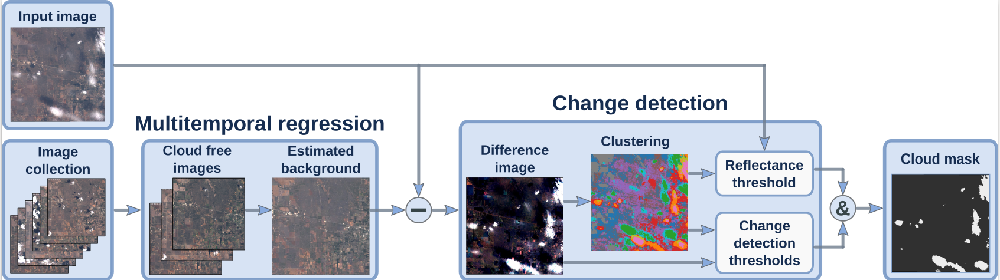

[](https://colab.research.google.com/github/IPL-UV/ee_ipl_uv/blob/master/examples/cloudscore_different_preds.ipynb)

# Multitemporal Cloud Masking in the GEE

This project contains a python package that extends the functionality of the [Google Earth Engine python API](https://developers.google.com/earth-engine/#api) (`ee`) to
implement the multitemporal cloud detection algorithms of ([Mateo-Garcia et al 2018](http://dx.doi.org/10.3390/rs10071079)) and ([Gomez-Chova et al 2017](http://dx.doi.org/10.1117/1.JRS.11.015005)).



Additional results of [Mateo-Garcia et al 2018](http://dx.doi.org/10.3390/rs10071079) can be browsed at http://isp.uv.es/projects/cdc/viewer_l8_GEE.html

## Update 2021-11

* The Biome dataset ingested in the Google Earth Engine can be seen at: https://code.earthengine.google.com/f5ff4b932dbfcdbe242b74938694a9c1

## Update 2020-06

* The Landsat-8 collection with FMask used in the articles is not longer available. We have modified the code to work with new Landsat-8 collections (`LANDSAT/LC08/C01/T1_TOA/`).
* We added a [notebook](#Examples) that applies our method to Sentinel-2 images. (from collection `COPERNICUS/S2/`)
* [Notebooks](#Examples) can be browsed in colab.

## Installation

The following code creates a fresh conda environment with required dependencies:

```bash
 conda create -c conda-forge -n ee python=3 numpy scipy jupyterlab matplotlib scikit-learn pillow requests luigi pandas scikit-image
pip install earthengine-api

python setup.py install
```

## Examples

The `examples` folder contains several notebooks that go step by step in the proposed multitemporal cloud detection schemes.

* The notebook `cloudscore_different_preds.ipynb` shows ready to use examples of the proposed cloud detection scheme for Landsat-8. [](https://colab.research.google.com/github/IPL-UV/ee_ipl_uv/blob/master/examples/cloudscore_different_preds.ipynb)
* The notebook `cloudscore_different_preds-S2.ipynb` shows ready to use examples of the proposed cloud detection scheme for Sentinel-2. [](https://colab.research.google.com/github/IPL-UV/ee_ipl_uv/blob/master/examples/cloudscore_different_preds-S2.ipynb)
* The notebook `multitemporal_cloud_masking_sample.ipynb` explains in great detail the method for background estimation 
proposed in ([Gomez-Chova et al 2017](http://dx.doi.org/10.1117/1.JRS.11.015005)) [](https://colab.research.google.com/github/IPL-UV/ee_ipl_uv/blob/master/examples/multitemporal_cloud_masking_sample.ipynb)
* The notebook `clustering_differences.ipynb` explains the clustering procedure and the thresholding of the image to form the cloud mask. [](https://colab.research.google.com/github/IPL-UV/ee_ipl_uv/blob/master/examples/clustering_differences.ipynb)

## Reproducibility

The folder `reproducibility` contains scripts, notebooks and instructions needed to reproduce the results of [Mateo-Garcia et al 2018: Multitemporal Cloud Masking in the Google Earth Engine](http://dx.doi.org/10.3390/rs10071079). See [reproducibility/README.md](reproducibility/README.md)
**Note**: due to changes in new tier Landsat-8 collections results might change. 

If you use this code please cite:
 
 ```
@article{mateo-garcia_multitemporal_2018,
 author = {Mateo-García, Gonzalo and Gómez-Chova, Luis and Amorós-López, Julia and Muñoz-Marí, Jordi and Camps-Valls, Gustau},
 doi = {10.3390/rs10071079},
 journal = {Remote Sensing},
 language = {en},
 link = {http://www.mdpi.com/2072-4292/10/7/1079},
 month = {jul},
 number = {7},
 pages = {1079},
 title = {Multitemporal {Cloud} {Masking} in the {Google} {Earth} {Engine}},
 urldate = {2018-07-10},
 volume = {10},
 year = {2018}
} 
 ```
 
## Related work

* [Benchmarking Deep Learning Models for Cloud Detection in Landsat-8 and Sentinel-2](https://github.com/IPL-UV/DL-L8S2-UV)
* [Landsat-8 to Proba-V transfer learning and Domain adaptation for cloud detection](https://github.com/IPL-UV/pvl8dagans)

## Acknowledgements

This work has been developed in the framework of the projects TEC2016-77741-R and PID2019-109026RB-I00 (MINECO-ERDF) and the GEE Award project _Cloud detection in the cloud_ granted to Luis Gómez-Chova.
